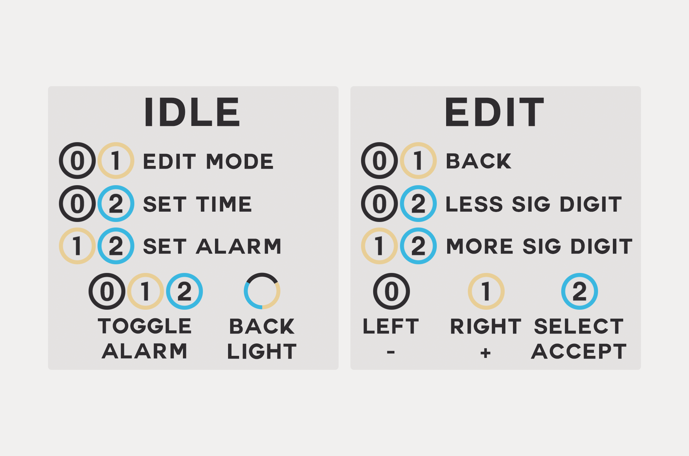
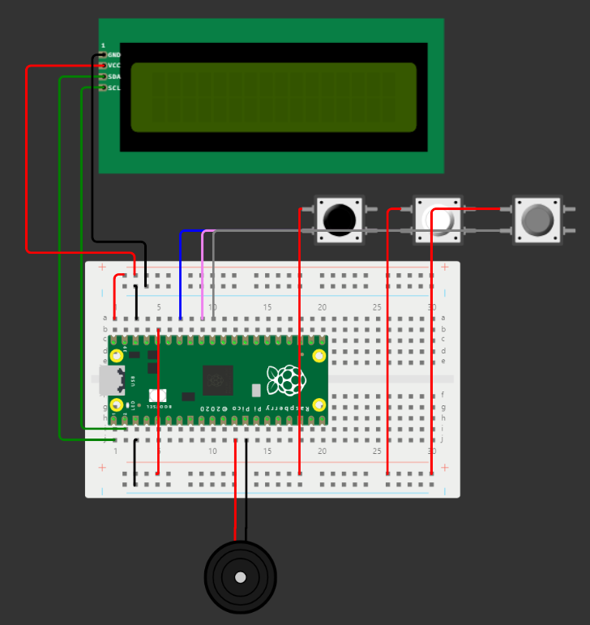

# Interactive Alarm Clock (Raspberry Pi Pico)


A highly reliable, robust and customizable alarm clock that forces you to wake up and stay awake by making you solve a challenge at a fixed place to stop the alarm sound.

## **Button Usage**




## **Circuit Schematic \[Recipe\]**

### **Basic Schematic \[Result\]**



### **Components \[Ingredients\]**

- Raspberry Pi Pico (RP2040, with headers)
- Half-Breadboard
- seeed Grove Active Buzzer (any passive buzzer would also work)
- 3x Mini Arcade Buttons
- LCD 16x2 with I2C

Also remember (optional):

- F<->F & M<->M jumper cables (combining creates M<->F cables)
- Potentially jumper cables with clamps
- USB 2.0 Micro Type B power connector for the Pi Pico
- USB 2.0 Type A -> Micro Type B for a connection to your computer

### **Setup Guide \[How To Cook\]**


```
[Default Pin Configuration]
VBUS: Power Line 1
GND.8: Power Line 1 Ground
3V3: Power Line 2
GND.1: Power Line 2 Ground

GP28: Button 0
GP27: Button 1
GP26: Button 2
GP9: Buzzer Signal
GND.3: Buzzer Ground

GP0: LCD I2C SDA
GP1: LCD I2C SCL
```

1. Put the Pi Pico on your breadboard as shown in the result.
1. Connect one power line with VBUS. We will draw power from the USB-B connection with 5V and connect this to the LCD
	1. If desired, you can add a redundant or manual power supply. Connect this to VSYS with a Schottky diode (required if there are two power sources, otherwise optional). Also connect the power line with VSYS instead. It must be around 5V.
1. Also connect that power line with a ground pin.
1. Connect the other power line with the 3V3 pin output and also connect a cable to a ground pin. This will be used for the buttons.
1. Connect the buttons in a way that 3.3V are input and connect them to the respective pins. A resistor is not needed. Internal Pull-Down is the default mode (can be changed in `globals.py` or `globals.json` if existent).
1. Add the buzzer. Connect it with power line 1 (5V), its ground, and the data pin (see above).
1. Add the LCD I2C. Also connect it with power line 1 (5V), its ground, and the data pins (see above).
	1. You may need to scan the I2C address first. Flash an I2C scanner and set it in the globals file.
1. Perform an [I2C address scan](https://www.freva.com/find-out-an-i2c-address-with-the-raspberry-pi-pico/) for the LCD. The address will need to be set in the globals file. You should also set `LcdIId` (I2C identifier, see online)
1. Flash the interactive clock, making sure to adjust to the globals file.
1. Put it in a box (e. g. cardboard) and print out the button guide if desired. Keep a hole for the buzzer for maximum volume.

Remember: You can customize all global variables on the device. They are not bounds-checked, so it is your responsibility to not be stupid.
